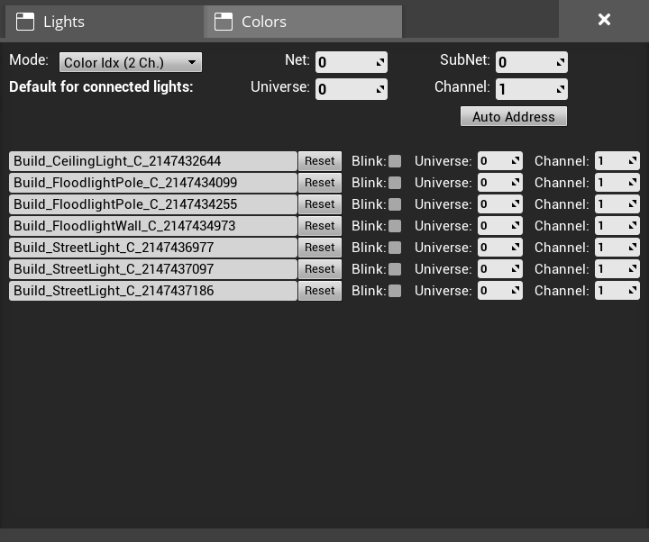
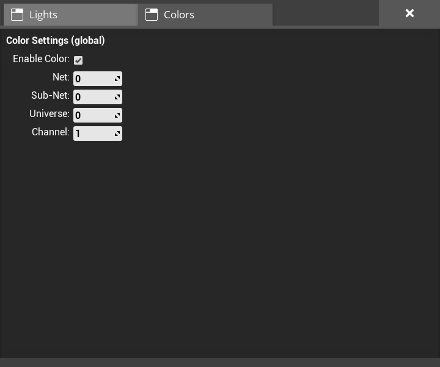

# Satisfactory LightControl Mod

Mod for the game [Satisfactory](https://www.satisfactorygame.com/) by Coffee Stain Studios to control lights with [Art-Net](https://en.wikipedia.org/wiki/Art-Net).

## Light Show Demo

  
[https://www.youtube.com/watch?v=rR7Teg_T_gs](https://www.youtube.com/watch?v=rR7Teg_T_gs)

The show was programmed with the light control software [DMXControl](https://dmxcontrol.de/):  

## Building

This mod can be built by adding it as a plugin to the [SatisfactoryModLoader](https://github.com/satisfactorymodding/SatisfactoryModLoader).
More details are available in the [modding documentation](https://docs.ficsit.app/satisfactory-modding/latest/index.html).

## Usage

This mod adds an "Art-Net Lights Control Panel" building to the game.
It is available in the AWESOME Shop when the regular Lights Control Panel is unlocked.
The control panel will receive Art-Net data from an external light control software.
All lights connected to the control panel can be configured within the control panel UI.

At the top are general settings to configure the mode as well as the Art-Net Net and Sub-Net the current Control Panel is listening on.
There are three modes available, each using the DMX values in a different way:

- `Color Idx (2 Ch.)`: Uses 2 DMX channels, a dimmer and a color idx to select one of the 7 global color slots of the game.
- `RGB (3 Ch.)`: Directly set RGB values using 3 DMX channels.
- `Dimmer + RGB (4 Ch.)`: Directly set RGB values using 3 DMX channels with an additional dimmer channel.

A detailed description of the DMX channels is available in the tables below.

Further, the default start address which will be set as the initial value for all newly connected lights can be configured.
Next, there is an `Auto Address` button allowing to continuously address all connected lights based on their location in the world.
The automatic addressing starts at the current default address and increases the channel for each light based on the currently selected mode.
The lights are ordered first west-to-east, then north-to-south, then bottom-to-top.

Below the general settings is a list of all lights connected to the current Art-Net Lights Control Panel.
On the left is a text box, where it is possible to give each light a meaningful description.
Next to it is a checkbox. If it is checked the light will start blinking.
This allows to easily find a connection between the actual light and the name in the list.
On the right, the start address of each light can be configured.

Within the color tab, the start address of the 7 global color channels can be configured.
Please note, that the 7 color slots are a global game setting and shared between all lights and lights control panels.
A detailed description of the DMX channels can be found in the table below.
It is possible to disable the colors.
This means the colors will not be changed via Art-Net and the colors set within a regular Light Control Panel are used.

### Light Channel Table - Mode "Dimmer + RGB"

| Channel | Function          |
|--------:|-------------------|
|       1 | Dimmer (0 - 100%) |
|       2 | Red (0 - 100%)    |
|       3 | Green (0 - 100%)  |
|       4 | Blue (0 - 100%)   |

### Light Channel Table - Mode "RGB"

| Channel | Function         |
|--------:|------------------|
|       1 | Red (0 - 100%)   |
|       2 | Green (0 - 100%) |
|       3 | Blue (0 - 100%)  |

### Light Channel Table - Mode "Color IDX"

| Channel | Function                         |
|--------:|----------------------------------|
|       1 | Dimmer (0 - 100%)                |
|       2 | Color Slot Idx (see table below) |

|     Value | Color Slot Idx |
|----------:|----------------|
|   0 -  35 | Color Slot 1   |
|  36 -  71 | Color Slot 2   |
|  72 - 107 | Color Slot 3   |
| 108 - 143 | Color Slot 4   |
| 144 - 179 | Color Slot 5   |
| 180 - 215 | Color Slot 6   |
| 216 - 255 | Color Slot 7   |

### Color Channel Table

| Channel | Function                        |
|--------:|---------------------------------|
|       1 | Color Slot 1 - Red (0 - 100%)   |
|       2 | Color Slot 1 - Green (0 - 100%) |
|       3 | Color Slot 1 - Blue (0 - 100%)  |
|       4 | Color Slot 2 - Red (0 - 100%)   |
|       5 | Color Slot 2 - Green (0 - 100%) |
|       6 | Color Slot 2 - Blue (0 - 100%)  |
|       7 | Color Slot 3 - Red (0 - 100%)   |
|       8 | Color Slot 3 - Green (0 - 100%) |
|       9 | Color Slot 3 - Blue (0 - 100%)  |
|      10 | Color Slot 4 - Red (0 - 100%)   |
|      11 | Color Slot 4 - Green (0 - 100%) |
|      12 | Color Slot 4 - Blue (0 - 100%)  |
|      13 | Color Slot 5 - Red (0 - 100%)   |
|      14 | Color Slot 5 - Green (0 - 100%) |
|      15 | Color Slot 5 - Blue (0 - 100%)  |
|      16 | Color Slot 6 - Red (0 - 100%)   |
|      17 | Color Slot 6 - Green (0 - 100%) |
|      18 | Color Slot 6 - Blue (0 - 100%)  |
|      19 | Color Slot 7 - Red (0 - 100%)   |
|      20 | Color Slot 7 - Green (0 - 100%) |
|      21 | Color Slot 7 - Blue (0 - 100%)  |
